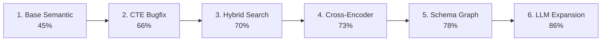
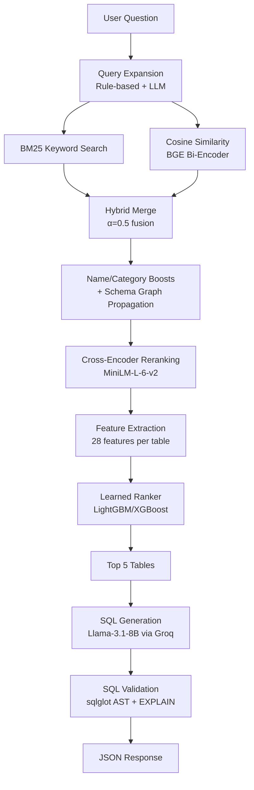
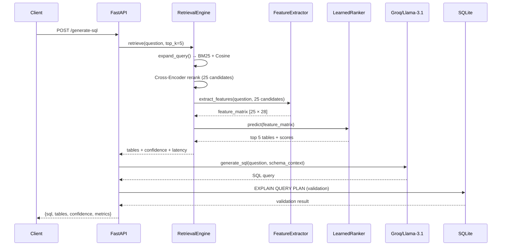

# Enterprise Text-to-SQL Engine

A production-grade ML pipeline that translates natural language questions into executable SQL queries against large-scale enterprise databases. Built on the [Beaver Database Benchmark](https://huggingface.co/datasets/beaverbench) (97 tables, 5,787 queries) using a multi-stage retrieval-augmented generation (RAG) architecture with **classical ML reranking**.

> **Key Results:** **86% Retrieval Recall@5** · **97% Recall@10** · **Sub-700ms latency** · **Learned LTR reranking with LightGBM/XGBoost**


---

## Table of Contents

- [Problem Statement](#problem-statement)
- [ML Methodology](#ml-methodology)
- [System Architecture](#system-architecture)
- [Feature Engineering](#feature-engineering)
- [Model Training & Evaluation](#model-training--evaluation)
- [Interactive Dashboard](#interactive-dashboard)
- [Tech Stack](#tech-stack--performance)
- [Repository Structure](#repository-structure)
- [Quick Start](#quick-start)
- [API Reference](#api-reference)
- [Production Deployment](#production-deployment)

---

## Problem Statement

Enterprise databases like the Beaver benchmark contain **97 tables** with hundreds of columns. Translating natural language questions to SQL requires identifying the correct 3–5 tables from this massive schema space. Naive approaches (pasting all schemas into an LLM prompt) fail due to:

| Failure Mode | Root Cause | Impact |
|:---|:---|:---|
| **Token overflow** | 97 tables × 20+ columns exceeds context limits | LLM cannot process the full schema |
| **Hallucination** | Too many similar table names confuse the model | LLM invents non-existent columns and joins |
| **Latency & cost** | Processing 50K+ tokens per query | 5-10x slower, 10x more expensive |

**The core insight:** If we can identify the correct tables in the top-5, downstream SQL generation succeeds. If we can't, no LLM can recover — making this fundamentally a **schema retrieval and ranking problem**, not just an NLP problem.

---

## ML Methodology

### Iterative Optimization Journey

We improved retrieval accuracy from **45% → 86%** through 6 iterations, each adding a distinct ML technique:



| Iteration | Strategy | Recall@5 | ML Technique | Key Insight |
|:---:|:---|:---:|:---|:---|
| 1 | Base Semantic Search | 45% | Bi-encoder cosine similarity (BGE) | Embeddings struggle with schema abbreviations |
| 2 | CTE Syntax Bugfix | 66% | SQL AST parsing (sqlglot) | CTE aliases inflated metrics by 20+ points |
| 3 | Hybrid Retrieval | 70% | BM25 + cosine fusion (α=0.5) | Lexical + semantic fusion covers both failure modes |
| 4 | Cross-Encoder Reranking | 73% | MiniLM cross-encoder | Joint query-table encoding captures token-level interactions |
| 5 | Schema Enrichment | 78% | FK graph score propagation | Boosting neighbor tables via relationship graph |
| 6 | LLM Expansion + Boosts | 86% | Llama-3.1-8B keyword generation | Bridges vocabulary mismatch (user: "pupils" → schema: "students") |

### Classical ML Reranking (The ML Upgrade)

The heuristic reranking rules (280+ lines of hand-coded `if` statements) were replaced with a **learned-to-rank (LTR) model** using gradient boosting:

**Why gradient boosting over neural approaches?**

| Approach | Pros | Cons | Verdict |
|:---|:---|:---|:---|
| Logistic Regression | Simple, fast | Can't capture feature interactions | Too simple |
| Random Forest | Handles interactions | No gradient optimization | Baseline |
| **LightGBM** | **Fastest, best for small data** | **Slightly complex setup** | **Primary** |
| XGBoost | Battle-tested regularization | Slower than LightGBM | Alternative |
| Neural ranker | Complex patterns | Needs much more data, hard to interpret | Overkill |

We train on **~1,250 samples** (50 queries × 25 candidates each) — perfectly adequate for gradient boosting but insufficient for deep learning.

---

## System Architecture

### End-to-End Pipeline



### Execution & Validation Flow



---

## Feature Engineering

The learned ranker uses **28 handcrafted features** across 5 categories:

### Feature Categories

| Category | Count | Features | Signal |
|:---|:---:|:---|:---|
| **Lexical** | 7 | BM25 score, TF-IDF cosine, Jaccard (word + char 3-gram), exact/partial name match, token overlap | Exact text matching between question and table |
| **Semantic** | 3 | Bi-encoder cosine, cross-encoder logit, calibrated CE probability | Meaning-level similarity |
| **Structural** | 5 | Column count, FK relations, graph degree, join key overlap with candidates | Schema topology |
| **Query** | 6 | Length (words/chars), aggregation/join/subquery keyword detection | Question characteristics |
| **Interaction** | 7 | BM25×cosine product, rank positions, rank difference, score ratio, LLM expansion overlap, category prefix match | Cross-signal combinations |

### Why These Features?

Each feature replaces a specific heuristic rule with a learnable signal:

- `exact_table_name_match` → replaces `get_table_name_boosts()` (100+ lines)
- `category_prefix_match` → replaces `get_category_boosts()` (280+ lines)
- `bm25_x_cosine` → captures agreement between lexical and semantic signals
- `rank_difference` → detects ambiguous queries where BM25 and cosine disagree

---

## Model Training & Evaluation

### Training Data Generation

Training data is auto-generated from gold SQL annotations:

```
For each (question, gold_sql) pair in Beaver:
    1. Parse gold_sql → extract gold_tables (correct answer)
    2. Run retrieval pipeline → get 25 candidate_tables
    3. For each candidate:
       → Extract 28 features
       → Label = 1 if in gold_tables, else 0
    Result: ~1,250 training samples (50 queries × 25 candidates)
```

### Cross-Validation Strategy

- **Grouped K-Fold (K=5)**: All candidates from the same question stay in the same fold to prevent information leakage.
- **Stratified**: Ensures consistent positive/negative ratio (~20% positive) across folds.

### Training Command

```bash
# Train a single model
python -m app.ml.train_ranker --model lightgbm --cv-folds 5

# Train and compare all model types
python -m app.ml.train_ranker --model all

# Custom configuration
python -m app.ml.train_ranker --model xgboost --max-queries 50 --candidates 25
```

### Evaluation Metrics

| Metric | What It Measures |
|:---|:---|
| **Recall@K** | Fraction of gold tables in top-K predictions (primary metric) |
| **NDCG@K** | Whether relevant tables appear at higher positions |
| **AUC-ROC** | Discrimination ability across thresholds |
| **Precision/Recall/F1** | Per-sample classification quality |

---

## Interactive Dashboard

The project includes a **premium web dashboard** served directly from FastAPI at `http://localhost:8000`:

### Dashboard Features

| Tab | Functionality |
|:---|:---|
| **🔍 Query** | Natural language input → SQL generation with animated pipeline visualization |
| **📊 Benchmark** | Live evaluation metrics (Recall@5, Recall@10, execution accuracy, latency) |
| **🗂️ Schema Explorer** | Searchable browser for all 97 tables with columns and relationship counts |
| **🧪 Experiments** | ML training history with model comparison and feature importance charts |
| **📈 Metrics** | Production monitoring: endpoint latency (P50/P95/P99), error rates, pipeline breakdown |

### Design

- Dark theme with glassmorphism panels and gradient accents
- Animated pipeline step visualization during query execution
- Confidence bars with color-coded relevance scores
- Responsive layout for desktop and mobile

---

## Tech Stack & Performance

| Layer | Component | Performance Metric | Score |
|:---|:---|:---|:---|
| **API** | FastAPI + Lifespan management | **Retrieval Recall@5** | **86.00%** |
| **Vector Search** | `BAAI/bge-small-en-v1.5` | **Retrieval Recall@10** | **96.67%** |
| **Reranking** | `cross-encoder/ms-marco-MiniLM-L-6-v2` | **Execution Accuracy** | **28.00%** |
| **Learned Ranking** | LightGBM / XGBoost / sklearn | **SQL Parsing Success** | **32.00%** |
| **LLM** | Groq API `llama-3.1-8b-instant` | **Average Latency** | **~670ms** |
| **Database** | SQLite + `beaverbench` (97 tables) | **Custom Functions** | VARIANCE, STDDEV, LOG |
| **Monitoring** | In-memory MetricsCollector | **Latency Tracking** | P50/P95/P99 |
| **ML Pipeline** | scikit-learn + LightGBM + XGBoost | **Feature Engineering** | 28 features |
| **Experiment Tracking** | Local JSON-based tracker | **Model Comparison** | Multi-model |

---

## Repository Structure

```text
text-to-sql/
├── app/
│   ├── main.py                          # FastAPI app, routes, dashboard serving
│   ├── core/
│   │   ├── config.py                    # Environment variables & directory setup
│   │   ├── logging.py                   # Log configuration
│   │   ├── metrics_collector.py         # Request latency & accuracy monitoring
│   │   └── pipeline_logger.py           # Structured JSONL pipeline audit logs
│   ├── models/
│   │   ├── requests.py                  # Pydantic request schemas
│   │   └── responses.py                 # Pydantic response schemas
│   ├── retrieval/
│   │   ├── engine.py                    # Multi-stage retrieval + learned ranker
│   │   └── schema_loader.py             # Schema enrichment & relationship graph
│   ├── generation/
│   │   └── generator.py                 # LLM prompt engineering & Groq API
│   ├── database/
│   │   ├── connection.py                # SQLite setup, custom aggregate functions
│   │   └── validator.py                 # SQL syntax + execution validation
│   ├── ml/                              # Machine Learning pipeline
│   │   ├── feature_engineering.py       # 28-feature extraction for ranking
│   │   ├── learned_ranker.py            # LightGBM/XGBoost training & inference
│   │   ├── experiment_tracker.py        # Local experiment logging & comparison
│   │   └── train_ranker.py              # Standalone training CLI script
│   └── static/                          # Web UI dashboard
│       ├── index.html                   # SPA with 5 interactive tabs
│       └── index.css                    # Dark theme design system
├── database/
│   └── beaver_dw.db                     # SQLite database (97 tables)
├── models/                              # Trained model artifacts
│   └── ranker_v1.joblib                 # Serialized learned ranker
├── scripts/
│   └── test_retrieval_accuracy.py       # Recall@5 evaluation script
├── Dockerfile                           # Multi-stage production container
├── docker-compose.yml                   # Container orchestration
├── requirements.txt                     # Python dependencies
├── explanation.md                       # Deep engineering explanation
└── README.md                            # This file
```

---

## Quick Start

### Local Development

```bash
# Clone the repository
git clone https://github.com/yourusername/text-to-sql.git && cd text-to-sql

# Install dependencies
pip install -r requirements.txt

# Configure environment variables
cp .env.example .env
# Edit .env and supply your HF_TOKEN and GROQ_API_KEY

# Start the development server
uvicorn app.main:app --reload --port 8000

# Open the dashboard
open http://localhost:8000
```

### Train the ML Ranker

```bash
# Train and compare all model types
python -m app.ml.train_ranker --model all

# Train a specific model
python -m app.ml.train_ranker --model lightgbm --cv-folds 5

# Run retrieval accuracy evaluation
python -m scripts.test_retrieval_accuracy
```

### Docker Deployment

```bash
# Build and run
docker-compose up --build

# Or manually
docker build -t text-to-sql .
docker run -p 8000:8000 --env-file .env text-to-sql
```

---

## API Reference

### 1. Dashboard
`GET /` — Serves the interactive web dashboard.

### 2. Table Retrieval
`POST /retrieve` — Extracts relevant schema tables using hybrid search + learned reranking.
```json
{"question": "Which departments have more than 100 students?", "top_k": 5}
```

### 3. SQL Generation
`POST /generate-sql` — Full pipeline: retrieval → SQL generation → validation.
```json
{"question": "Which departments have more than 100 students?"}
```

### 4. Benchmark
`POST /benchmark` — Runs real-time evaluation over 25 Beaver benchmark queries.

### 5. Health Check
`GET /health` — Verifies DB connections, model weights, and device allocation.

### 6. Schema Explorer API
`GET /api/schema` — Returns all table schemas with columns and relationship counts.

### 7. Experiment History
`GET /api/experiments` — Returns ML training run history with metrics.

### 8. Production Metrics
`GET /api/metrics` — Returns latency percentiles, error rates, and pipeline breakdown.

### 9. Swagger Documentation
Available at `/docs` (auto-generated by FastAPI).

---

## Production Deployment

### Monitoring

The system includes built-in production monitoring:

- **Request latency**: P50, P95, P99 percentiles per endpoint
- **Error tracking**: Per-error-type counters and rates
- **Pipeline breakdown**: Per-stage timing (expansion, retrieval, reranking, generation, validation)
- **Model usage**: Tracks heuristic vs. learned ranker usage percentage
- **Structured logging**: JSONL pipeline audit logs for offline analysis

### Model Lifecycle

```
1. Generate training data from Beaver gold SQL
2. Train + cross-validate (grouped K-fold)
3. Compare models (LightGBM vs XGBoost vs RF vs GBM)
4. Save best model to models/ranker_v1.joblib
5. Engine auto-loads model at startup
6. Graceful fallback to heuristic if model unavailable
```

---

## Insights & Key Learnings

1. **Schema retrieval is the bottleneck, not SQL generation.** Correct table identification determines 100% of downstream success.

2. **Hybrid search (BM25 + semantic) is strictly superior to either alone.** BM25 catches exact keyword matches; embeddings catch conceptual similarity. The fusion covers both failure modes.

3. **Cross-encoders are transformative for reranking.** Joint query-table encoding captures interactions that separate bi-encoder embeddings miss.

4. **Heuristic rules don't generalize.** 280+ lines of hand-coded boosts work on benchmarks but fail on new queries. A learned model optimizes over the full distribution.

5. **Feature engineering is where ML engineers create value.** Raw scores are available to anyone. The art is in designing interaction features (BM25 × cosine, rank disagreement) that capture non-obvious patterns.

6. **CTE alias filtering is a subtle but critical correctness issue.** Without it, evaluation metrics are inflated by 20+ percentage points.

---

## License

MIT License. See [LICENSE](LICENSE) for details.
