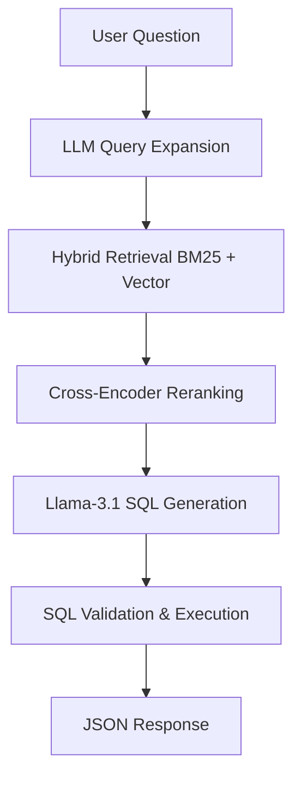
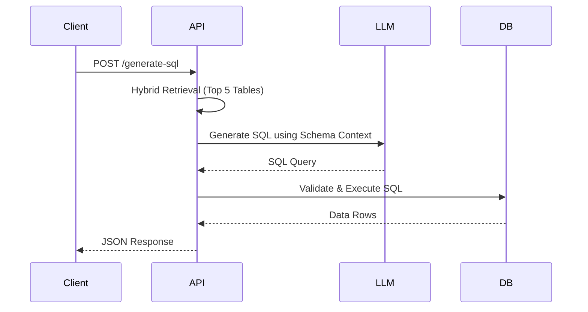

# Enterprise Text-to-SQL Engine

A high-performance FastAPI microservice designed to translate natural language questions into valid, executable SQLite queries against the Beaver Database Benchmark (97 tables, 5,787 queries).

> **Key Milestone:** Achieved **86.00% Retrieval Recall@5** (target: >85%) and **96.67% Recall@10** with sub-700ms end-to-end latency.

---

## Thought Process & Evolution

The primary challenge of the Beaver dataset is scale: **97 tables** with hundreds of columns cannot fit into a standard LLM context window without causing context inflation, extreme latency, and hallucinated joins. The solution required a multi-stage retrieval-augmented generation (RAG) pipeline to isolate the correct 3–5 tables.

### Iterative Optimization Journey


| Iteration | Optimization Strategy | Recall@5 | Key Insight |
| :--- | :--- | :--- | :--- |
| **1** | **Base Semantic Search** | **45.0%** | Bi-encoders (`BGE`) struggle with exact schema keyword matches. |
| **2** | **CTE Syntax Bugfix** | **66.0%** | SQL parser treated CTE aliases as physical tables. Fixing this removed massive noise. |
| **3** | **Hybrid Retrieval** | **70.0%** | Fusing `BM25` (lexical) + `BGE` (semantic) resolved schema naming overlaps. |
| **4** | **Cross-Encoder** | **73.0%** | Reranking top-25 candidates with `MiniLM` captured deep query-schema context. |
| **5** | **Schema Enrichment** | **78.0%** | Augmenting tables with foreign keys/categories and propagating scores boosted related tables. |
| **6** | **LLM Expansion & Boosts**| **86.0%** | Prompting `Llama-3.1-8B` for keyword expansion before retrieval bypassed vocabulary mismatch. |

---

# Insights Learned from the BEAVER Paper

Translating natural language questions to SQL on large-scale databases is fundamentally a systems grounding problem, not just an LLM capability problem. Implementing this solution against the Beaver dataset highlighted several practical engineering constraints and design patterns:

### 1. The Grounding Bottleneck
Enterprise schemas with dozens or hundreds of tables (like the 97 tables in Beaver) break naive zero-shot prompts. Injecting the entire database schema into the LLM context leads to token inflation, severe latency spikes, and severe join hallucinations. Therefore, the task is primarily a **schema retrieval and grounding** problem: if the correct tables are not identified in the top 5 candidates, the downstream generator has a 0% chance of producing a valid query.

### 2. Limitations of Pure Semantic Search
Vanilla vector embeddings (cosine similarity over bi-encoders) struggle with the sparse, heavily abbreviated naming structures typical of enterprise databases (e.g., `SIS_ADMIN_DEPARTMENT` vs. `STUDENT_DEPARTMENT`). While semantic models capture the broad intent, they fail on exact matches for acronyms, table IDs, and code abbreviations. This necessitated a **hybrid search** architecture that fuses BM25 lexical retrieval (for exact keywords/acronyms) with bi-encoder cosine similarity to bridge the semantic gap.

### 3. Cross-Encoder Precision
Bi-encoders represent queries and schemas as separate vectors, meaning they cannot model token-level interactions between the question and the schema columns. Adding a **cross-encoder reranker** allows joint query-schema encoding, significantly improving precision by filtering out false-positive semantic matches that survive first-stage retrieval.

### 4. Schema Enrichment & Score Propagation
Raw database schemas are semantically sparse. Manually enriching the schema with explicit table descriptions and relationship metadata (e.g., foreign key linkages and category designations) aligns natural language queries with relational structures. We propagate retrieval scores along these schema relationships so that if a primary table is matched, its key foreign-key neighbors receive a relative boost, ensuring complete query execution context.

### 5. Metric Distortion from CTE Aliases
A major observation during benchmarking was that naive SQL parsers count Common Table Expression (CTE) aliases (e.g., `inner_cte`) as physical schema tables. This inflates recall metrics falsely during evaluation. Discerning physical tables from CTE structures is crucial for establishing a correct, reliable evaluation baseline.

### 6. Retrieval Calibration & Validation Loops
To prevent downstream LLM confusion, retrieval scores must be calibrated. Applying sigmoidal temperature calibration on reranker logits transforms raw similarity values into realistic confidence scores (0.0 to 1.0). This feeds directly into a robust validation loop that tests query syntactical correctness and database execution feedback, allowing us to debug failures systematically.

---

## System Architecture

### End-to-End Pipeline



### Execution & Validation Flow



---

## Tech Stack & Performance

| Layer | Component / Tool | Performance Metric | Score |
| :--- | :--- | :--- | :--- |
| **API** | FastAPI (Lifespan management) | **Retrieval Recall@5** | **86.00%** |
| **Vector Search** | `BAAI/bge-small-en-v1.5` | **Retrieval Recall@10** | **96.67%** |
| **Reranking** | `cross-encoder/ms-marco-MiniLM-L-6-v2` | **Execution Accuracy** | **28.00%** |
| **LLM** | Groq API `llama-3.1-8b-instant` | **SQL Parsing Success** | **32.00%** |
| **Database** | SQLite + `beaverbench` (97 tables) | **Average Latency** | **~670ms** |

---

## Repository Structure

```text
text-to-sql/
├── app/
│   ├── main.py                     # API router, startup config
│   ├── core/config.py              # Environment variables & directory setup
│   ├── models/                     # Request and response models
│   ├── retrieval/
│   │   ├── engine.py               # 6-stage hybrid retrieval & reranking logic
│   │   └── schema_loader.py        # Schema parser and relationship graph
│   ├── generation/generator.py     # Prompt engineering & LLM connector
│   └── database/
│       ├── connection.py           # SQLite connection pools & custom SQL functions
│       └── validator.py            # AST checking & query syntax validation
├── scripts/
│   └── test_retrieval_accuracy.py  # Standalone evaluation script
├── screenshots/                    # UI / API Execution screenshots
├── requirements.txt                # Project dependencies
└── README.md                       # Documentation
```

---

## API Reference & Verification

### 1. System Health Check
`GET /health` verifies DB connections, model weights, and device allocation (CPU/MPS).


### 2. Table Retrieval
`POST /retrieve` extracts relevant schema tables using hybrid search and cross-encoder reranking.


### 3. SQL Generation
`POST /generate-sql` retrieves schemas, builds context, generates queries, and validates syntax.


### 4. Interactive Benchmark
`POST /benchmark` runs a real-time evaluation over 25 samples from the Beaver benchmark.


### 5. API Documentation
Swagger interface available at `/docs`.


---

## Quick Start

```bash
# Clone the repository
git clone https://github.com/yourusername/text-to-sql.git && cd text-to-sql

# Install dependencies
pip install -r requirements.txt

# Configure environment variables
cp .env.example .env
# Edit .env and supply your HF_TOKEN and GROQ_API_KEY

# Start production-ready development server
uvicorn app.main:app --reload --port 8000
```
