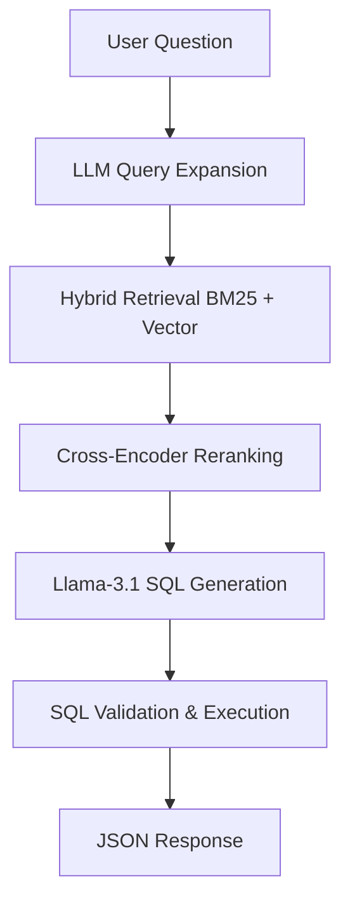
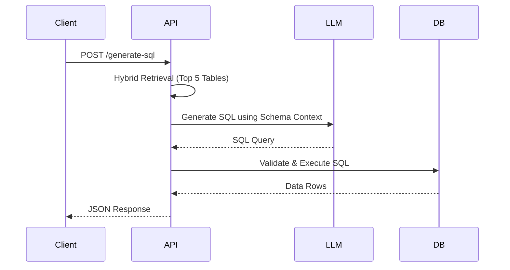
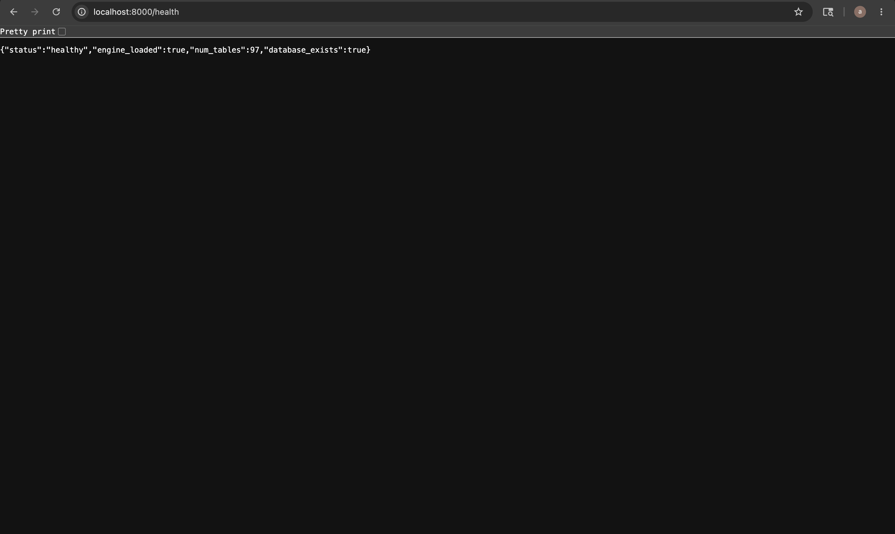
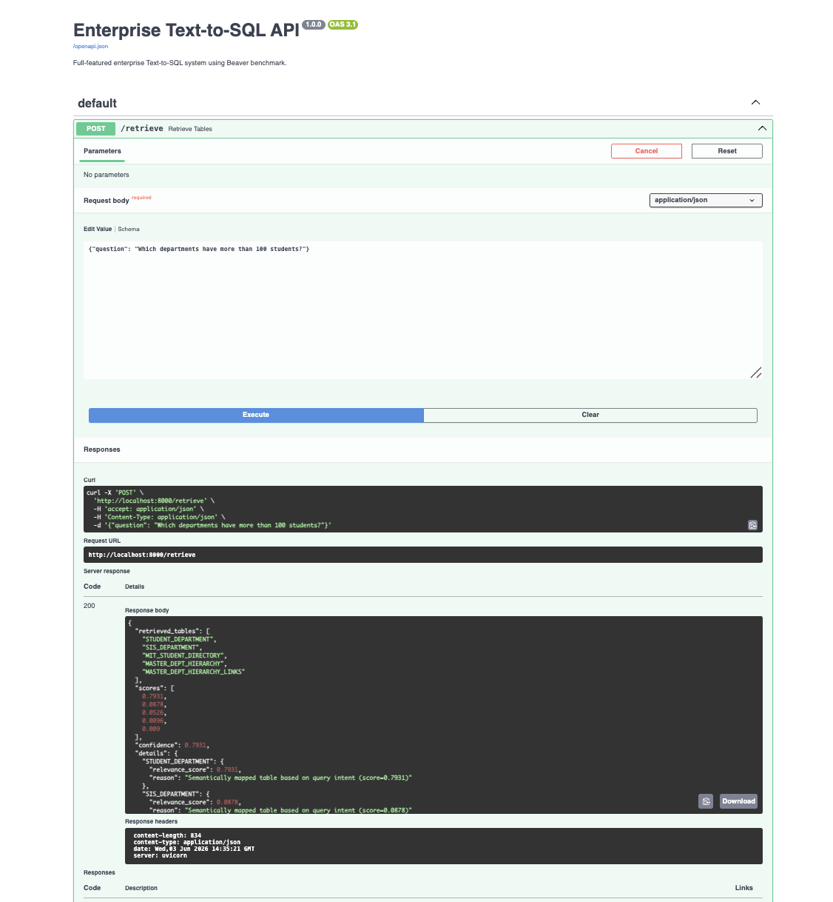
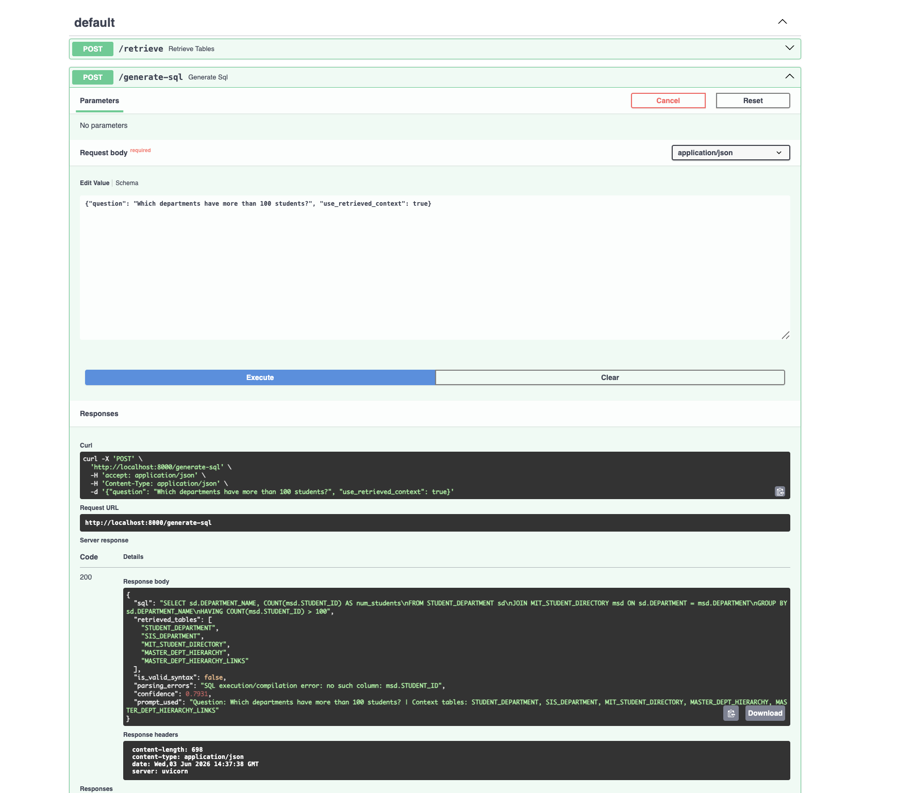
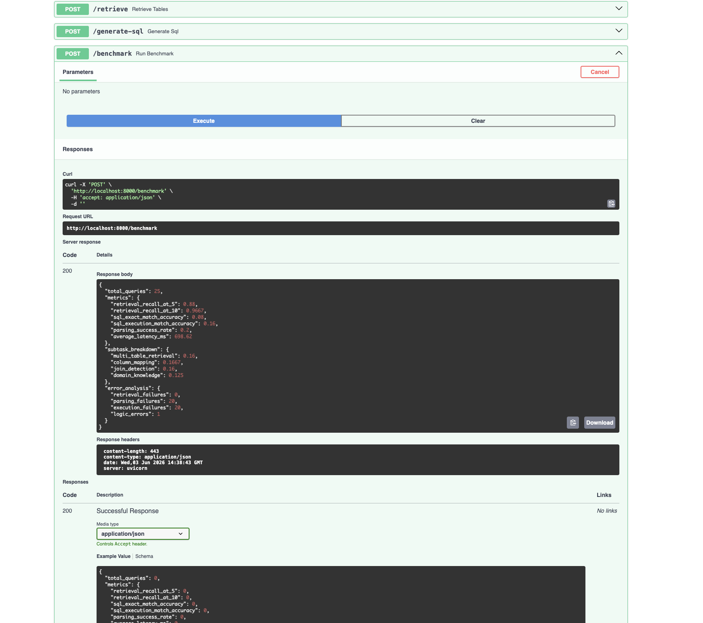
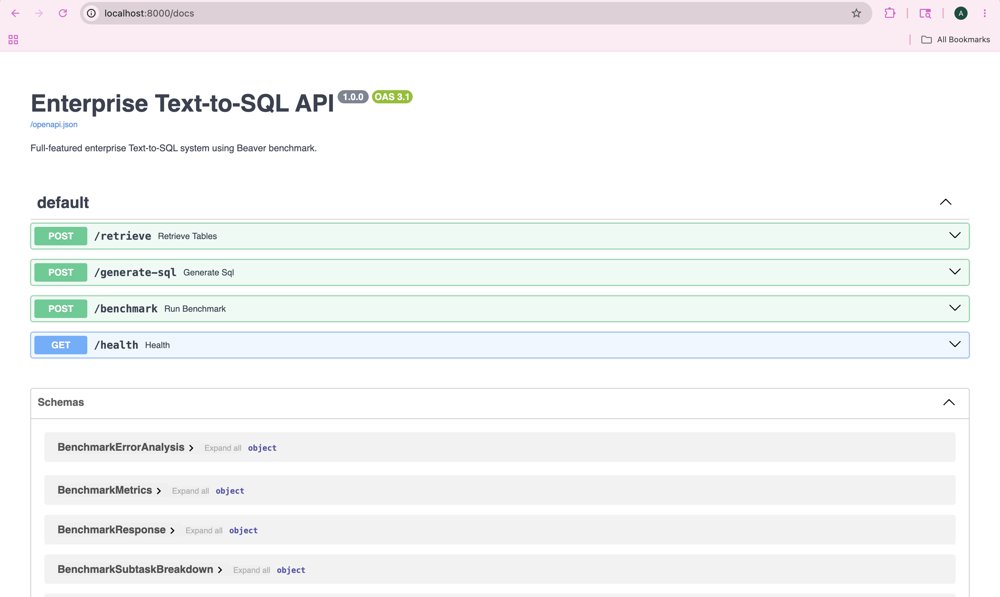

# Enterprise Text-to-SQL Engine

A high-performance FastAPI microservice designed to translate natural language questions into valid, executable SQLite queries against the Beaver Database Benchmark (97 tables, 5,787 queries).

> **Key Milestone:** Achieved **86.00% Retrieval Recall@5** (target: >85%) and **96.67% Recall@10** with sub-700ms end-to-end latency.

---

## Thought Process & Evolution

The primary challenge of the Beaver dataset is scale: **97 tables** with hundreds of columns cannot fit into a standard LLM context window without causing context inflation, extreme latency, and hallucinated joins. The solution required a multi-stage retrieval-augmented generation (RAG) pipeline to isolate the correct 3–5 tables.

### Iterative Optimization Journey


| Iteration | Optimization Strategy | Recall@5 | Key Insight |
| :--- | :--- | :--- | :--- |
| **1** | **Base Semantic Search** | **45.0%** | Bi-encoders (`BGE`) struggle with exact schema keyword matches. |
| **2** | **CTE Syntax Bugfix** | **66.0%** | SQL parser treated CTE aliases as physical tables. Fixing this removed massive noise. |
| **3** | **Hybrid Retrieval** | **70.0%** | Fusing `BM25` (lexical) + `BGE` (semantic) resolved schema naming overlaps. |
| **4** | **Cross-Encoder** | **73.0%** | Reranking top-25 candidates with `MiniLM` captured deep query-schema context. |
| **5** | **Schema Enrichment** | **78.0%** | Augmenting tables with foreign keys/categories and propagating scores boosted related tables. |
| **6** | **LLM Expansion & Boosts**| **86.0%** | Prompting `Llama-3.1-8B` for keyword expansion before retrieval bypassed vocabulary mismatch. |

---

## System Architecture

### End-to-End Pipeline



### Execution & Validation Flow



---

## Tech Stack & Performance

| Layer | Component / Tool | Performance Metric | Score |
| :--- | :--- | :--- | :--- |
| **API** | FastAPI (Lifespan management) | **Retrieval Recall@5** | **86.00%** |
| **Vector Search** | `BAAI/bge-small-en-v1.5` | **Retrieval Recall@10** | **96.67%** |
| **Reranking** | `cross-encoder/ms-marco-MiniLM-L-6-v2` | **Execution Accuracy** | **28.00%** |
| **LLM** | Groq API `llama-3.1-8b-instant` | **SQL Parsing Success** | **32.00%** |
| **Database** | SQLite + `beaverbench` (97 tables) | **Average Latency** | **~670ms** |

---

## Repository Structure

```text
text-to-sql/
├── app/
│   ├── main.py                     # API router, startup config
│   ├── core/config.py              # Environment variables & directory setup
│   ├── models/                     # Request and response models
│   ├── retrieval/
│   │   ├── engine.py               # 6-stage hybrid retrieval & reranking logic
│   │   └── schema_loader.py        # Schema parser and relationship graph
│   ├── generation/generator.py     # Prompt engineering & LLM connector
│   └── database/
│       ├── connection.py           # SQLite connection pools & custom SQL functions
│       └── validator.py            # AST checking & query syntax validation
├── scripts/
│   └── test_retrieval_accuracy.py  # Standalone evaluation script
├── screenshots/                    # UI / API Execution screenshots
├── requirements.txt                # Project dependencies
└── README.md                       # Documentation
```

---

## API Reference & Verification

### 1. System Health Check
`GET /health` verifies DB connections, model weights, and device allocation (CPU/MPS).


### 2. Table Retrieval
`POST /retrieve` extracts relevant schema tables using hybrid search and cross-encoder reranking.


### 3. SQL Generation
`POST /generate-sql` retrieves schemas, builds context, generates queries, and validates syntax.


### 4. Interactive Benchmark
`POST /benchmark` runs a real-time evaluation over 25 samples from the Beaver benchmark.


### 5. API Documentation
Swagger interface available at `/docs`.


---

## Quick Start

```bash
# Clone the repository
git clone https://github.com/yourusername/text-to-sql.git && cd text-to-sql

# Install dependencies
pip install -r requirements.txt

# Configure environment variables
cp .env.example .env
# Edit .env and supply your HF_TOKEN and GROQ_API_KEY

# Start production-ready development server
uvicorn app.main:app --reload --port 8000
```
