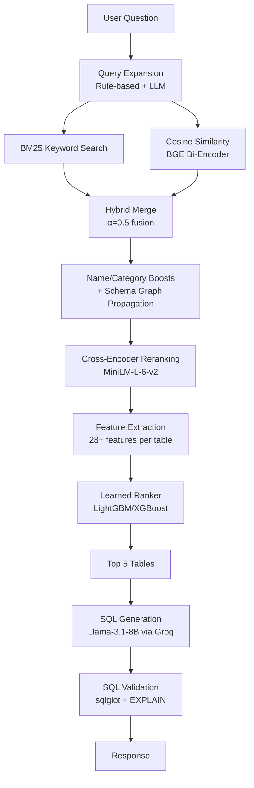
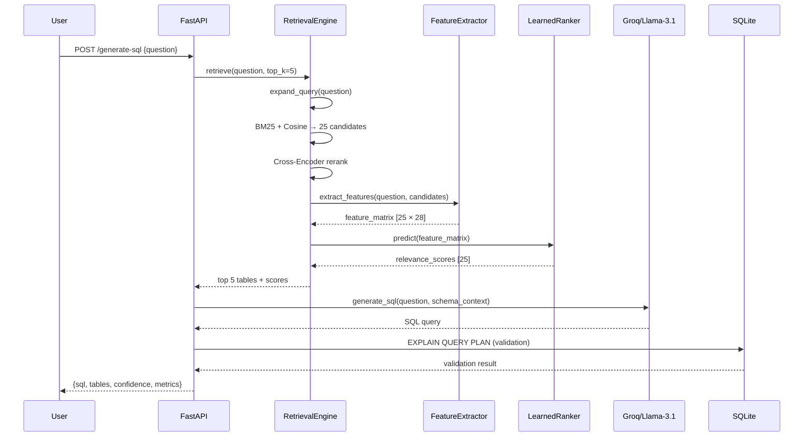

# Enterprise Text-to-SQL Engine — Deep Engineering Explanation

This document explains **what** we built, **why** every decision was made, **how** the components interact, and **what tradeoffs** we accepted. It is written to transfer understanding, not just describe code.

---

## 1. Problem Statement

### What problem are we solving?

We want a system where a human types a plain English question (e.g., *"Which departments have more than 100 students?"*) and the system:

1. Identifies which database tables are relevant.
2. Generates a valid SQL query against those tables.
3. Executes the query and returns results.

This is the **Text-to-SQL** problem — one of the hardest applied NLP challenges in production.

### Why does this problem exist?

Enterprise databases are **too large for LLMs to handle naively**. Our target database (the Beaver benchmark) has **97 tables** with hundreds of columns. If you paste all 97 table schemas into an LLM prompt:

- **Token overflow**: The combined schema exceeds most LLM context windows (or consumes the majority of available tokens, leaving no room for reasoning).
- **Hallucination**: The model gets confused by 97 similar-looking tables and invents columns, joins, or table names that don't exist.
- **Latency & cost**: Processing 50K+ tokens per query is slow and expensive.

**Therefore**, the core challenge is NOT SQL generation — it's **schema retrieval**. If we can identify the correct 3-5 tables, a capable LLM can usually generate the right SQL. If we can't, the downstream generator has a 0% chance of success regardless of how good the LLM is.

### What constraints are present?

| Constraint | Impact |
|:---|:---|
| 97 tables with cryptic names (e.g., `TIP_SUBJECT_OFFERED`) | Semantic search struggles with abbreviations |
| CTE aliases in gold SQL look like physical tables | Metrics are distorted if not filtered |
| Groq free-tier rate limits (30 req/min) | Need caching, throttling, retry logic |
| SQLite lacks statistical functions (VARIANCE, STDDEV) | Must register custom aggregate functions |
| Cold start: models must load at startup | Lifespan management via FastAPI |

---

## 2. Mental Model

### How should you think about this system?

Think of it as a **4-stage funnel** that progressively narrows the search space:

```
Stage 1: Query Expansion
    "Which departments have more than 100 students?"
    → "Which departments have more than 100 students? COUNT GROUP BY HAVING
        SIS_DEPARTMENT STUDENT enrollment department_code..."

Stage 2: Candidate Retrieval (Broad Net)
    97 tables → Top 25 candidates
    Uses BM25 (exact keyword match) + Cosine Similarity (semantic match)
    + Schema graph score propagation

Stage 3: Precision Reranking (Fine Filter)
    Top 25 candidates → Top 5 tables
    Cross-Encoder reads (question, table_description) jointly
    + Learned LTR model with 28+ handcrafted features

Stage 4: SQL Generation
    Top 5 tables → SQL query
    LLM (Llama-3.1-8B) generates SQL using schema context
```

**Key insight**: Each stage is designed to have high recall but progressively higher precision. Stage 2 casts a wide net (we'd rather include a wrong table than miss a right one). Stage 3 applies expensive but accurate reranking to the small candidate set.

### What abstractions are involved?

| Abstraction | Responsibility |
|:---|:---|
| `SchemaLoader` | Loads raw table metadata from HuggingFace, enriches with column roles, relationships, and domain-specific use cases |
| `RetrievalEngine` | Orchestrates the 4-stage retrieval pipeline |
| `FeatureExtractor` | Computes 28+ features for (question, table) pairs — the bridge between retrieval and ML |
| `LearnedRanker` | Classical ML model (LightGBM/XGBoost) trained on features to predict table relevance |
| `SQLGenerator` | Prompt engineering + LLM API call + SQL cleanup |
| `SQLValidator` | Syntax check (sqlglot AST parsing) + execution check (EXPLAIN QUERY PLAN) |
| `ExperimentTracker` | Logs training runs, metrics, feature importances for reproducibility |

### How do the components interact?



---

## 3. Solution: The Retrieval Pipeline (Before ML Upgrade)

### Original 6-Stage Heuristic Pipeline

The original system achieved **86% Recall@5** through iterative optimization:

| Stage | What it does | Why it helps | Recall@5 |
|:---|:---|:---|:---|
| Base Semantic | Cosine similarity with BGE embeddings | Captures conceptual similarity | 45% |
| CTE Bugfix | Filter CTE aliases from gold SQL | Removes noise from evaluation | 66% |
| Hybrid Search | BM25 + Cosine fusion (α=0.5) | BM25 catches exact keyword matches that embeddings miss | 70% |
| Cross-Encoder | MiniLM reranking of top-25 candidates | Joint query-table encoding captures token-level interactions | 73% |
| Schema Enrichment | Domain-specific table descriptions + FK graph | Gives embeddings more context to work with | 78% |
| LLM Expansion | Llama-3.1-8B generates related keywords | Bridges vocabulary mismatch (user says "pupils", DB has "students") | 86% |

### What's wrong with this approach?

The system works, but it has a **fundamental engineering problem**: the reranking logic is dominated by **hundreds of lines of hand-coded heuristic rules** (see `get_category_boosts()` — 280+ lines of `if "keyword" in question_lower` patterns).

**Why this is bad:**

1. **Brittleness**: Every new failure case requires adding a new `if` statement. The rules interact in unpredictable ways.
2. **Overfitting to the benchmark**: The rules are tuned to the specific 50 evaluation queries. They won't generalize.
3. **Unmaintainable**: No engineer can reason about the combined effect of 40+ overlapping boost rules.
4. **Not ML**: For an ML role, hand-coded heuristics demonstrate engineering but not ML methodology.

### The fix: Replace heuristics with a learned model

We keep the multi-stage architecture (it's sound engineering) but replace the heuristic reranking with a **classical ML model trained on features**:

- **Features** capture the same signals as the heuristics (BM25 score, cosine similarity, name matches, domain keywords) but in a systematic, learnable format.
- **The model** (LightGBM/XGBoost gradient boosting) learns the optimal combination of these signals from data.
- **Cross-validation** prevents overfitting to the training set.
- **Feature importance** analysis tells us which signals actually matter (instead of guessing).

---

## 4. Solution: The Learned Ranking Model (ML Upgrade)

### Why LightGBM/XGBoost?

| Approach | Pros | Cons | Verdict |
|:---|:---|:---|:---|
| **Logistic Regression** | Simple, interpretable, fast | Can't capture feature interactions (BM25 × cosine) | Too simple |
| **Random Forest** | Handles interactions, robust to outliers | No gradient-based optimization, slower to converge | Decent baseline |
| **Gradient Boosting (sklearn)** | Good performance, built-in | Slow training, limited hyperparameter control | Good |
| **LightGBM** | Fastest training, best with small data, leaf-wise splits | Slightly more complex setup | **Best choice** |
| **XGBoost** | Battle-tested, great regularization | Slightly slower than LightGBM for small datasets | **Strong alternative** |
| **Neural ranker** | Can learn complex patterns | Needs much more data, hard to interpret, overkill for 97 tables | Overkill |

**Decision**: We use **LightGBM as primary, XGBoost as comparison**. Both are gradient boosting frameworks — the industry standard for tabular ranking problems. We also train a Random Forest as a non-boosting baseline for comparison.

### Feature Engineering Design

Features are organized into 5 categories. Each captures a different "view" of the relationship between a question and a table:

```
LEXICAL FEATURES (exact text matching)
├── bm25_score: Raw BM25 keyword relevance
├── tfidf_cosine: TF-IDF cosine similarity  
├── jaccard_word: Word-level Jaccard overlap
├── jaccard_char_3gram: Character 3-gram Jaccard overlap
├── exact_table_name_match: 1 if table name appears literally in question
├── partial_table_name_match: 1 if any table name segment matches
└── query_table_token_overlap: Count of shared tokens

SEMANTIC FEATURES (meaning-level matching)
├── biencoder_cosine: BGE bi-encoder cosine similarity
├── cross_encoder_logit: Raw cross-encoder output
└── cross_encoder_calibrated: Sigmoid-calibrated probability

STRUCTURAL FEATURES (schema topology)
├── num_columns: Number of columns in the table
├── num_fk_relations: Number of foreign key relationships
├── schema_graph_degree: Number of connected tables in the relationship graph
├── has_join_key_overlap: Whether table shares join keys with other top candidates
└── num_shared_join_keys: Count of shared join keys

QUERY FEATURES (question characteristics)
├── query_length_words: Number of words in the question
├── query_length_chars: Number of characters in the question
├── has_aggregation_keyword: 1 if question contains COUNT/AVG/SUM/etc.
├── has_join_keyword: 1 if question implies multi-table joins
├── has_subquery_indicator: 1 if question suggests nested queries
└── num_sql_keywords_detected: Count of SQL-related keywords

INTERACTION FEATURES (cross-signal combinations)
├── bm25_x_cosine: Product of BM25 and cosine scores
├── bm25_rank: BM25 rank position (1 = best)
├── cosine_rank: Cosine similarity rank position
├── rank_difference: |bm25_rank - cosine_rank| (disagreement signal)
├── score_ratio: bm25 / cosine ratio
├── llm_expansion_overlap: Count of LLM-expanded keywords matching table
└── category_prefix_match: 1 if table prefix matches question domain
```

**Why these specific features?**

Each feature captures a signal that was previously encoded as a heuristic rule:
- `exact_table_name_match` replaces the `get_table_name_boosts()` function
- `category_prefix_match` replaces the `get_category_boosts()` prefix matching
- `bm25_x_cosine` captures the interaction between lexical and semantic relevance
- `rank_difference` captures cases where BM25 and cosine disagree (a strong signal for ambiguous queries)

### Training Data Generation

Training data is auto-generated from the Beaver gold SQL:

```
For each (question, gold_sql) pair in the dataset:
    1. Parse gold_sql to extract gold_tables (the correct answer)
    2. Run the retrieval pipeline to get candidate_tables (top 25)
    3. For each candidate table:
       - Extract all 28 features
       - Label = 1 if table is in gold_tables, else 0
    4. This produces ~25 training samples per question
```

With 50 questions × 25 candidates = ~1,250 training samples. This is small for deep learning but **perfectly adequate for gradient boosting** (which excels on small tabular datasets).

### Cross-Validation Strategy

We use **Stratified K-Fold (K=5)** cross-validation grouped by question:

- **Why stratified?** The dataset is imbalanced (~20% positive labels). Stratification ensures each fold has the same positive/negative ratio.
- **Why grouped by question?** If we split randomly, the model could see some candidate tables from question Q in training and other candidates from Q in validation — this leaks information. Grouping ensures all candidates from the same question are in the same fold.
- **Why K=5?** With only 50 questions, K=5 gives us 40 train / 10 val questions per fold — enough for boosting to learn, enough for reliable validation.

---

## 5. Edge Cases & Failure Modes

### Boundary Conditions

| Case | What happens | How we handle it |
|:---|:---|:---|
| Question with zero matching tables | BM25 and cosine return near-zero scores for everything | Return top-k by score anyway; confidence will be low |
| Question that mentions a CTE name as if it's a real table | Parser would count it as a gold table, inflating recall | CTE filtering in `extract_tables_and_ctes()` |
| Table name is a substring of another (e.g., `BUILDING` vs `FCLT_BUILDING_HIST`) | Prefix matching could boost wrong table | We match full segments, not substrings |
| Groq API returns 429 rate limit | SQL generation fails | Exponential backoff with retry, file-based caching |
| Question contains SQL injection | Malicious SQL could corrupt the database | Read-only queries, EXPLAIN QUERY PLAN validation |
| Model file not found at startup | Learned ranker can't load | Graceful fallback to heuristic reranking |

### Scaling Concerns

| Concern | Current state | Mitigation |
|:---|:---|:---|
| 97 tables | Manageable for brute-force BM25/cosine | Indexed search would be needed for 1000+ tables |
| Single-threaded inference | Bi-encoder + cross-encoder run sequentially | Could parallelize with async/threadpool |
| Model loading at startup | ~2-3 seconds | Cache embeddings, lazy-load cross-encoder |
| SQLite single-writer | Write contention under concurrent requests | Read-only for queries; only writes are to cache files |

---

## 6. Architecture

### Component Map

```
text-to-sql/
├── app/
│   ├── main.py                          # FastAPI app, routes, lifespan
│   ├── core/
│   │   ├── config.py                    # Environment variables, paths
│   │   ├── logging.py                   # Log configuration
│   │   ├── metrics_collector.py         # [NEW] Request latency, accuracy tracking
│   │   └── pipeline_logger.py           # [NEW] Structured JSON pipeline audit logs
│   ├── models/
│   │   ├── requests.py                  # Pydantic request schemas
│   │   └── responses.py                 # Pydantic response schemas
│   ├── retrieval/
│   │   ├── schema_loader.py             # Load + enrich Beaver table metadata
│   │   └── engine.py                    # 6-stage retrieval pipeline + learned ranker
│   ├── generation/
│   │   └── generator.py                 # LLM prompt engineering + Groq API
│   ├── database/
│   │   ├── connection.py                # SQLite setup, custom functions
│   │   └── validator.py                 # SQL syntax + execution validation
│   ├── ml/                              # [NEW] Machine Learning pipeline
│   │   ├── feature_engineering.py       # 28+ feature extraction for (question, table) pairs
│   │   ├── learned_ranker.py            # LightGBM/XGBoost training + inference
│   │   ├── experiment_tracker.py        # Local experiment logging
│   │   └── train_ranker.py              # Standalone training script
│   └── static/                          # [NEW] Web UI Dashboard
│       ├── index.html                   # SPA dashboard
│       └── index.css                    # Design system
├── database/
│   └── beaver_dw.db                     # SQLite database (97 tables)
├── scripts/
│   └── test_retrieval_accuracy.py       # Recall@5 evaluation script
└── models/                              # [NEW] Trained model artifacts
    └── ranker_v1.joblib                 # Serialized learned ranker
```

### Data Flow



---

## 7. Tradeoffs

### Simplicity vs. Flexibility

- **Choice**: We keep the heuristic pipeline AND add a learned ranker as an optional overlay, rather than replacing one with the other.
- **Why**: The heuristic pipeline is battle-tested at 86% recall. The learned ranker should improve it, but we need a fallback if the model file is missing or corrupted.
- **Cost**: More code to maintain (two paths). Worth it for reliability.

### Memory vs. Speed

- **Choice**: We precompute and cache all table embeddings at startup rather than computing them per-request.
- **Why**: 97 table embeddings fit easily in memory (~10MB). Per-request computation would add ~200ms latency.
- **Cost**: Slightly longer startup time (~2s). Negligible.

### Readability vs. Optimization

- **Choice**: Feature extraction creates a list of dictionaries (one per feature) rather than a raw numpy array.
- **Why**: Named features are debuggable. You can print `features["bm25_score"]` and understand what's happening. A raw array `X[i, 7]` is opaque.
- **Cost**: Slightly slower due to dict overhead. Irrelevant for 25 candidates.

### Short-term vs. Long-term Maintainability

- **Choice**: We auto-generate training data from gold SQL rather than manually labeling.
- **Why**: Manual labeling doesn't scale and is error-prone. Auto-generation is reproducible and can be re-run when the pipeline changes.
- **Cost**: Training labels depend on the quality of gold SQL parsing. If the parser has bugs, training data has noise.

---

## 8. Key Insights

1. **Schema retrieval is the bottleneck, not SQL generation.** If the correct tables are in the top-5, LLMs can usually generate valid SQL. If they're not, nothing downstream can fix it.

2. **Hybrid search (BM25 + semantic) is strictly better than either alone.** BM25 catches exact keyword matches that embeddings miss. Embeddings catch conceptual matches that BM25 misses. The fusion covers both failure modes.

3. **Cross-encoders are transformative for reranking.** Bi-encoders encode query and document separately — they can't model token-level interactions. Cross-encoders read them jointly. This is why cross-encoder reranking improved recall by 3 percentage points.

4. **Heuristic rules don't generalize.** The 280+ lines of `get_category_boosts()` were effective for the benchmark but would fail on new queries. A learned model generalizes because it optimizes a loss function over the entire training distribution.

5. **Feature engineering is where ML engineers earn their salary.** The raw signals (BM25 score, cosine score) are already available. The art is in designing interaction features (BM25 × cosine, rank difference) that capture non-obvious patterns.

6. **CTE alias filtering is a subtle but critical correctness issue.** Without it, evaluation metrics are inflated by 20+ percentage points because CTE aliases are counted as physical tables.

---

## 9. Understanding Checklist

- [x] Problem statement: Why can't we just paste all 97 tables into an LLM?
- [x] Motivation: Why is schema retrieval the bottleneck?
- [x] Core abstractions: SchemaLoader → RetrievalEngine → FeatureExtractor → LearnedRanker → SQLGenerator
- [x] Data flow: Question → Expansion → Hybrid Search → Reranking → Feature Extraction → ML Prediction → SQL Generation
- [x] Design decisions: Why LightGBM? Why 28 features? Why grouped K-fold CV?
- [x] Edge cases: CTE filtering, rate limiting, model fallback, SQL injection
- [x] Failure modes: Zero matching tables, API rate limits, model corruption
- [x] Tradeoffs: Heuristic fallback, precomputed embeddings, named features
- [x] Performance implications: Startup caching, per-request latency budget
- [ ] Testing strategy: Will be addressed during implementation
- [ ] Deployment considerations: Will be addressed in Pillar 4
